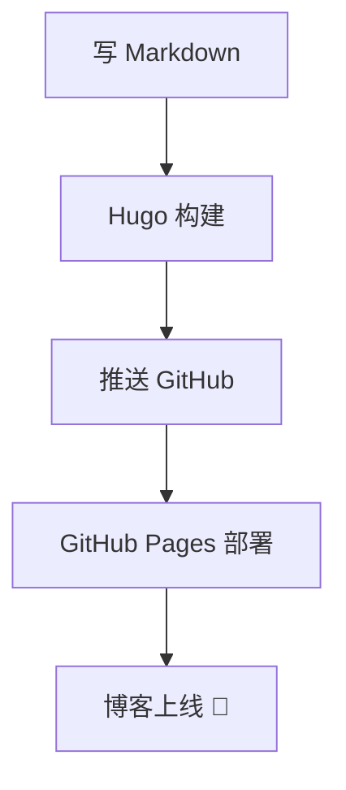

## 为什么选择 Hugo + Stack

经过对比多个静态博客框架，最终选择了 Hugo + Stack 主题：

- ⚡ Hugo 构建速度极快（毫秒级）
- 🎨 Stack 卡片式布局，浅色模式清新简洁
- 📊 原生 Mermaid 图表 + KaTeX 数学公式
- 🔍 内置搜索、归档、标签云

## 代码高亮示例

```python
def hello():
    """一个简单的示例"""
    print("Hello, World! 🌍")
    return {"status": "ok", "message": "博客已上线"}

if __name__ == "__main__":
    hello()
```

## Mermaid 流程图示例



## 数学公式示例

行内公式：$E = mc^2$

块级公式：

$$\sum_{i=1}^{n} i = \frac{n(n+1)}{2}$$

---

> 这是博客的第一篇文章，后续会持续更新技术笔记和生活记录。
